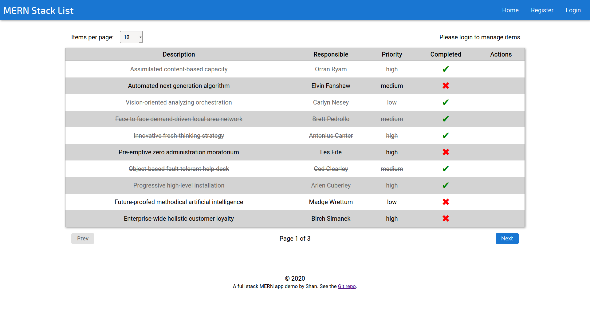
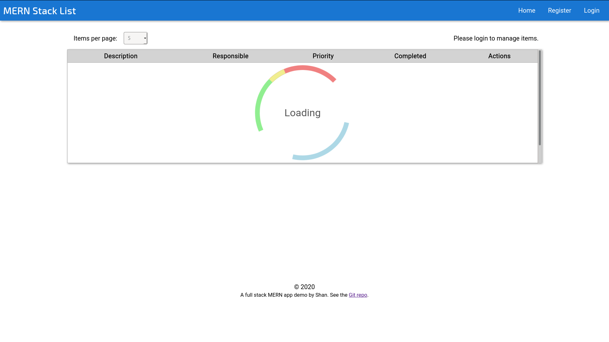
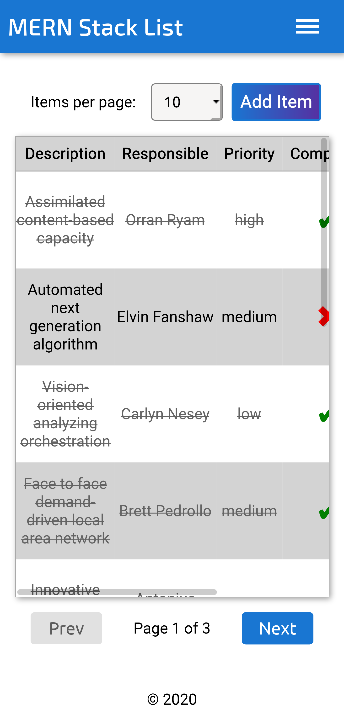
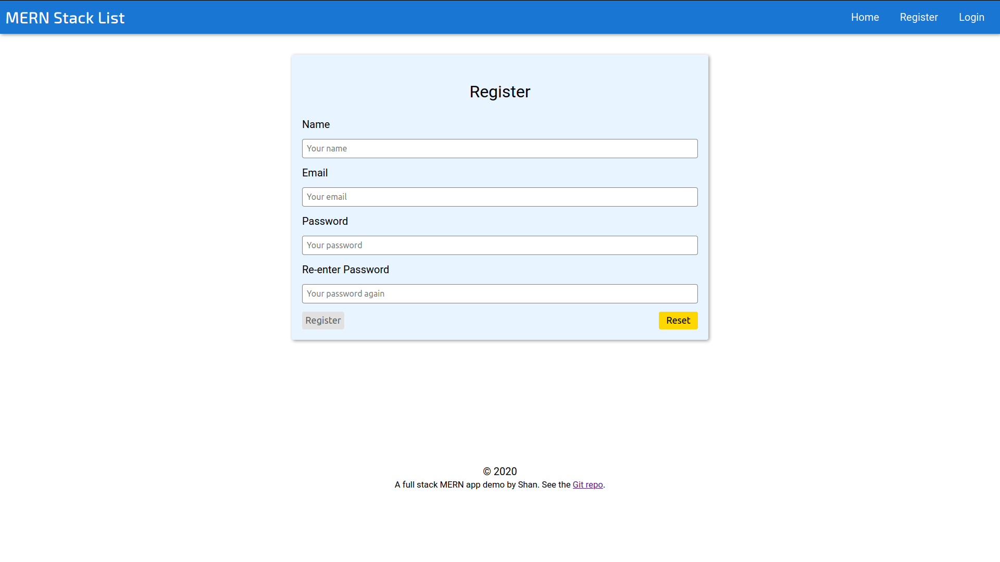
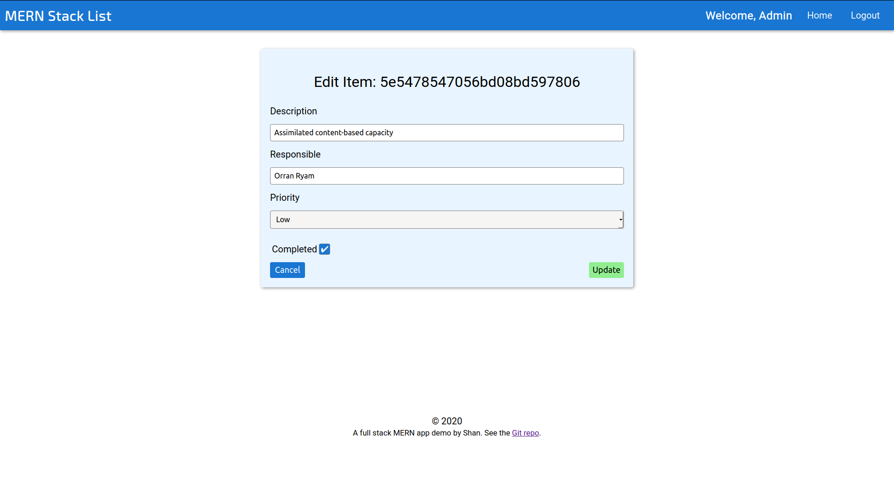

# MERN Item List Frontend

A MERN Stack Frontend Application for creating and maintaing a To Do list. This is a demo project that builds out a frontend React app that connects to an Express.js RESTful backend and provides full CRUD (Create, Read, Updated and Delete) functionality.

The main motivation behind this project was to explore a realistic Redux usage scenario as well as the testing invloved with such an implementation.

The styles are 100% custom CSS, but draw some inspiration from Google's [Material Design](https://material.io/design/). The views are all fully responsive and change based on the `screen` attribute and `min-width: 768px`.

See the related [backend project](https://github.com/sbhaseen/mern-item-list-backend).

## Getting Started

This project was bootstrapped with `create-react-app` and should retain the default script parameters in `package.json`.

### Prerequisites

A Node.js installation with `npm` capable of running React 16.

### Installing

Install locally with `npm`:

```
npm install
```

For development the usual `create-react-app` defaults apply.

```
npm run start
```

## Tests

Test are performed with `jest`.

```
npm test
```

Please note that using the CLI command `jest` (instead of `npm test`) may lead to some errors due to the use of `@testing-library/react` which is handled by the `react-scripts` module.

### Testing details

The primary objective of testing this application focuses on verifying the logic behind the Redux implemention (action, reducers and store). A secondary objective is to ensure that the essential components render without crashing (ItemList, NavBar, etc.) however no implement details are tested as those may change over time.

Another point to note is that since Redux logic is tested seperately and the `connect` function from `react-redux` wrap a component with this logic, it was deemed redundant to test a Component and Redux together. The redux testing style was adopted from the Redux documentation which can be found [here](https://redux.js.org/recipes/writing-tests/).

All tests are in the folder `tests` under `src`.

## Deployment

If a production build is required, use:

```
npm build
```

## Usage

The app is a stand-alone frontend application which is capable of interacting with a RESTful API backend. As such, it can function independently of a backend and will show a "No Data to Display" message if it cannot resolve data from a backend.

When connected to a backend, the table of item data will show a spinner as the data loads in the background.

In the navigation bar, some links are displayed based on the authentication state. There exist two possibilites: authenticated (auth) links or guest links.

Guest links consist of Register and Login.

- To register, one must click on the "Register" link.
- To login, one must click on the "Login" link.

Authenticated or auth links only consits of the Logout feature, which simply clears the authentication token from storage.

When accessing the main view or "Home", the items will be visible in a paginated table format and will have certain views hidden or show based on the global authentication (auth) state.

For items specifically, the authentication enabled views are:

- Add Item (button)
- Under the actions column:
  - Edit (button)
  - Delete (button)

If a user is not logged in, these buttons will not be visible.

For pagination, the user can navigate using `Prev` or `Next` buttons under the table. A user may also select the items per page from a drop-down menu above the table. The default limit is 5 and the programmed limits are 5 and 10, respectively. The idea was to be as mobile-friendly as possible and higher limits simply add more scolling on mobile screens.

Some screenshots of the app:

The main view:



The main view loading (spinner):



The mobile view of the main page:



The Register form:



Editing an item:



## Built With

- [React](https://reactjs.org/) - A JavaScript library for building user interfaces
- [Redux](https://redux.js.org/) - A Predictable State Container for JS Apps
- [Axios](https://github.com/axios/axios) - A promise based HTTP client for the browser and Node.js

## License

This project is licensed under the MIT License - see the [LICENSE.md](LICENSE.md) file for details
